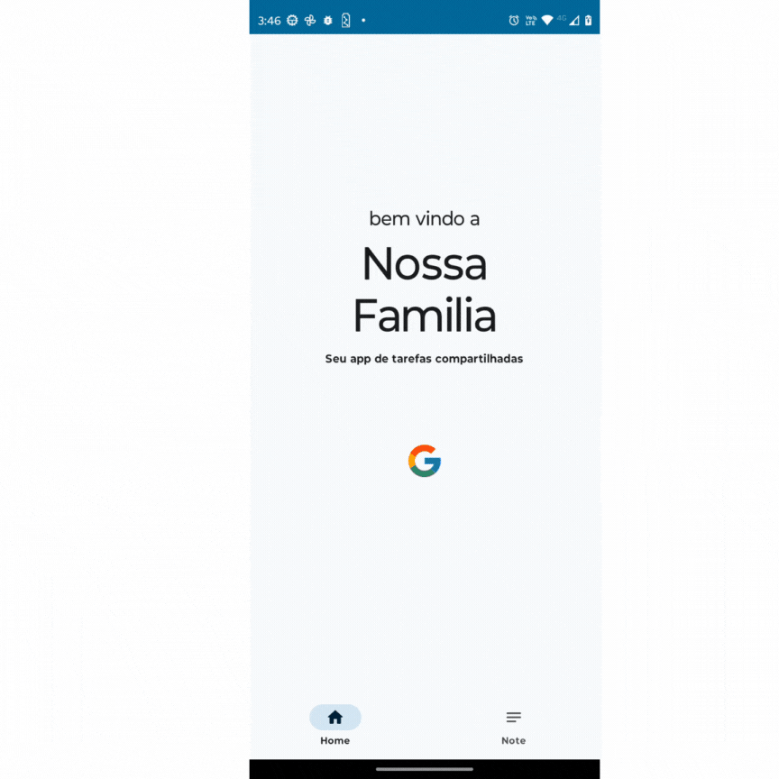
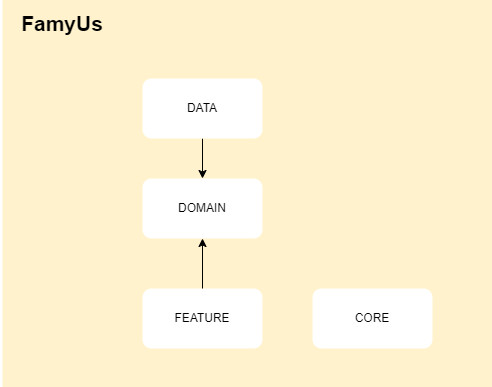

# FamyUs app
An app to handle family home tasks in a easy way (and free).
This app is to practice good practices developing mobile 
application and is also for case study to new patterns, apis, libs, etc...
## Preview

## Architecture 
This is a brief explanation of how the app was organized 
 

As you can see this project is modularized into 3 modules + 1 auxiliary module, each one has your responsibilities, you can check at each module path to check their's responsibilities. 