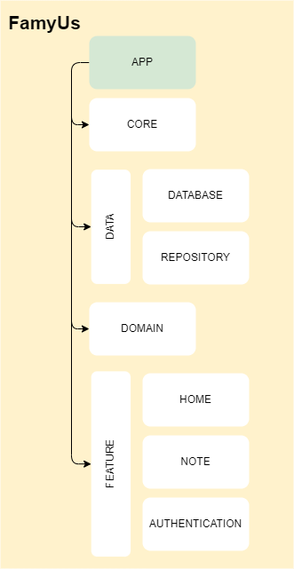

#App Module:
The **app** module is the main root module, is responsible to retain your application and start it, also it initialize the others features.
> The app module depends all other modules because is it that
initialize the Koin application.

