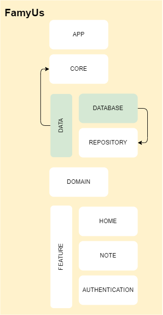

# Database Module:
The **database** module is responsible to  provide all business logic related to the database (ROOM in this case), also it has the DAOs and the repository interfaces implemented to communicate with the outers modules.

