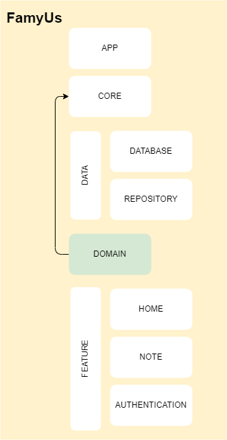

# Domain Module:
The **domain** module retain all project business logic, it's is responsible to driven to the ui the use cases necessary to the presentation layer to build the UI, fetch data and furthermore.  It doesn't need and don't have (and shouldn't) any android dependencies, is framework unaware, the entire code is pure kotlin.
