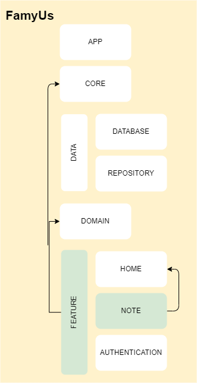

# Note Module:

The **Note** module is responsible to provide the note screen and its features like:
- add a task note
- remove a task note
- edit a task note
- update a task note
- show the task note
## Architecture:
These are the dependencies of this module:
